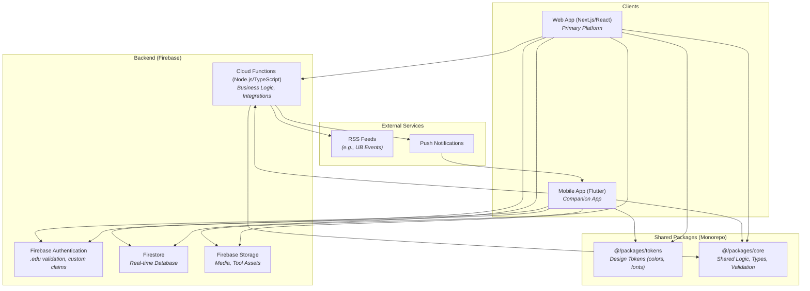

# HIVE System Architecture Overview

_Last Updated: February 2025_
_Purpose: A consolidated overview of the HIVE full-stack architecture, providing a single source of truth for development._

## 1. Core Philosophy & Strategy

The HIVE platform is built on a **web-first** development philosophy, prioritizing the **React/Next.js web application** for its broad accessibility, rapid iteration speed, and suitability for complex features like HiveLAB.

The **Flutter mobile application** serves as a companion experience, providing on-the-go access to core features. It inherits proven patterns and user flows validated on the web platform.

The entire system is backed by **Firebase**, providing a robust, scalable, and real-time backend. The project is organized as a **monorepo** to facilitate code sharing and maintain consistency between the web and mobile clients.

## 2. High-Level Architecture Diagram

## 3. Component Breakdown

### 3.1. Clients

-   **Web Application (`apps/web`):** The primary platform, built with Next.js, React, and TypeScript. It supports the full feature set, including the HiveLAB Tool Composer. It is designed to be fully responsive for mobile web access.
-   **Mobile Application (`apps/mobile`):** A native-quality companion app built with Flutter. It focuses on the core user experience of content consumption, event coordination, and community interaction. While it consumes Tools created in HiveLAB, it does not include the Tool Composer itself.

### 3.2. Backend (Firebase)

-   **Firebase Authentication (`firebase/auth`):** Manages user identity, session management, and security. It enforces `.edu` email validation and uses custom claims to manage user roles like `Builder`.
-   **Firestore (`firestore.rules`, `firestore.indexes.json`):** The primary real-time NoSQL database. It stores all application data, from user profiles to Space content and Tool configurations. Firestore Rules are critical for securing data access.
-   **Firebase Storage (`storage.rules`):** Used for storing user-generated content such as images, videos, and other assets for Tools.
-   **Cloud Functions (`functions/`):** A serverless Node.js/TypeScript environment for backend logic that shouldn't run on the client. Key responsibilities include:
    -   Processing RSS feeds for event ingestion.
    -   Sending push notifications.
    -   Performing complex analytics like "Tool surge" detection.
    -   Data validation and synchronization across different parts of the system.

### 3.3. Shared Packages (Monorepo)

To maximize code reuse and consistency, the monorepo contains shared packages.

-   **`@/packages/tokens`:** Contains design tokens (e.g., colors, typography, spacing) that are shared between the web and mobile apps to ensure a consistent brand aesthetic.
-   **`@/packages/core`:** A crucial package for sharing platform-agnostic code. This can include:
    -   TypeScript/Dart type definitions for core entities (e.g., `User`, `Space`, `Tool`).
    -   Shared validation logic (e.g., email validators, form validation rules).
    -   Constants and enums used across the stack.

### 3.4. External Services & Integrations

-   **RSS Feeds:** The system integrates with external RSS feeds (e.g., from the University at Buffalo) to automatically seed the platform with campus events. This is handled by a Cloud Function.
-   **Push Notifications:** Firebase Cloud Messaging (FCM) is used to send targeted push notifications to the mobile app for event reminders, social traces, and other timely updates.

## 4. Monorepo Directory Structure

The codebase is organized in a monorepo to manage the different parts of the stack in a single repository.

-   `apps/`: Contains the client applications.
    -   `apps/mobile/`: The Flutter mobile application.
    -   `apps/web/`: The Next.js web application.
-   `packages/`: Contains shared code intended for use in multiple applications (web, mobile, functions).
    -   `packages/core/`: Shared business logic, types, and utilities.
    -   `packages/tokens/`: Shared design tokens.
-   `functions/`: Contains the source code for Firebase Cloud Functions.
-   `memory-bank/`: Contains all project documentation, including this document. 